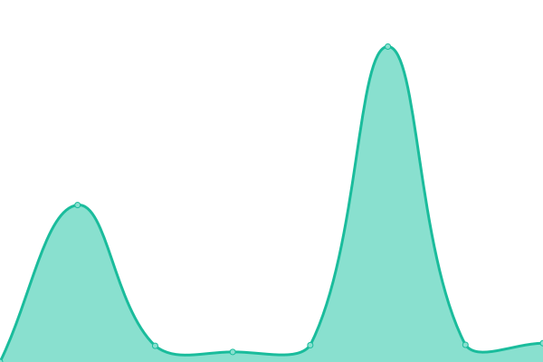

# [📈 Live Status](https://status.thexyz.com): <!--live status--> **All monitered services are currenly operational**

This repository contains the open-source uptime monitor and status page for [Upptime](https://upptime.js.org), powered by [Upptime](https://github.com/upptime/upptime).

With [Upptime](https://upptime.js.org), you can get your own unlimited and free uptime monitor and status page, powered entirely by a GitHub repository. We use [Issues](https://github.com/upptime/upptime/issues) as incident reports, [Actions](https://github.com/ptoone/Thexyz-Network-Status/actions) as uptime monitors, and [Pages](https://status.thexyz.com) for the status page.

<!--start: status pages-->
<!-- This summary is generated by Upptime (https://github.com/upptime/upptime) -->
<!-- Do not edit this manually, your changes will be overwritten -->
<!-- prettier-ignore -->
| URL | Status | History | Response Time | Uptime |
| --- | ------ | ------- | ------------- | ------ |
|  [DNS](https://dns.thexyz.com) | ✅ Up | [dns.yml](https://github.com/ptoone/Thexyz-Network-Status/commits/HEAD/history/dns.yml) | 

 714ms
     
 | 

<a href="https://status.thexyz.com/history/dns">100.00%</a>
    

|  [Webmail](https://webmail.thexyz.com) | ✅ Up | [webmail.yml](https://github.com/ptoone/Thexyz-Network-Status/commits/HEAD/history/webmail.yml) | 

 267ms
     
 | 

<a href="https://status.thexyz.com/history/webmail">100.00%</a>
    

|  [Email Admin](https://admin.thexyz.com) | ✅ Up | [email-admin.yml](https://github.com/ptoone/Thexyz-Network-Status/commits/HEAD/history/email-admin.yml) | 

 576ms
     
 | 

<a href="https://status.thexyz.com/history/email-admin">100.00%</a>
    

|  [Client Area](https://www.thexyz.com) | ✅ Up | [client-area.yml](https://github.com/ptoone/Thexyz-Network-Status/commits/HEAD/history/client-area.yml) | 

 494ms
     
 | 

<a href="https://status.thexyz.com/history/client-area">79.35%</a>
    

|  [Quarantine](https://quarantine.thexyz.com) | ✅ Up | [quarantine.yml](https://github.com/ptoone/Thexyz-Network-Status/commits/HEAD/history/quarantine.yml) | 

 715ms
     
 | 

<a href="https://status.thexyz.com/history/quarantine">100.00%</a>
    

|  [Blocklists](https://bl.thexyz.com) | ✅ Up | [blocklists.yml](https://github.com/ptoone/Thexyz-Network-Status/commits/HEAD/history/blocklists.yml) | 

 648ms
     
 | 

<a href="https://status.thexyz.com/history/blocklists">100.00%</a>
    

|  [Roundcube](https://webmail.thexyzserver.com) | ✅ Up | [roundcube.yml](https://github.com/ptoone/Thexyz-Network-Status/commits/HEAD/history/roundcube.yml) | 

 334ms
     
 | 

<a href="https://status.thexyz.com/history/roundcube">100.00%</a>
    

|  [Virtual Private Servers](https://login.thexyzserver.com) | ✅ Up | [virtual-private-servers.yml](https://github.com/ptoone/Thexyz-Network-Status/commits/HEAD/history/virtual-private-servers.yml) | 

 294ms
     
 | 

<a href="https://status.thexyz.com/history/virtual-private-servers">100.00%</a>
    

<!--end: status pages-->

[**Visit our status website →**](https://status.thexyz.com)

## 📄 License

- Powered by: [Upptime](https://github.com/upptime/upptime)
- Code: [MIT](./LICENSE) © [Upptime](https://upptime.js.org)
- Data in the `./history` directory: [Open Database License](https://opendatacommons.org/licenses/odbl/1-0/)
